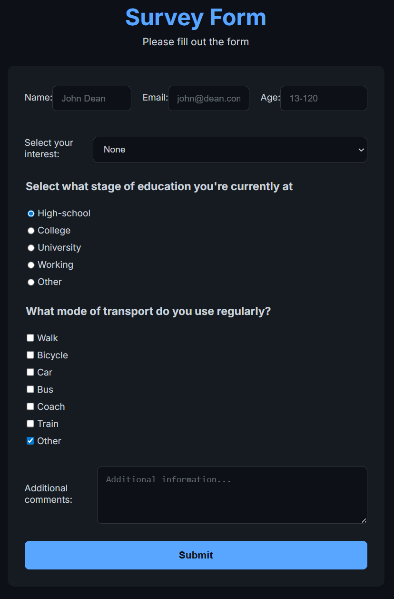

# Projects from Responsive Web Design

This folder contains projects built following the freeCodeCamp [Responsive Web Design](https://www.freecodecamp.org/learn/2022/responsive-web-design/) course.

## Projects List

[Survey Form](https://www.freecodecamp.org/learn/2022/responsive-web-design/build-a-survey-form-project/build-a-survey-form)

Click the any of the images below to be taken to a live demo of the project:

  

